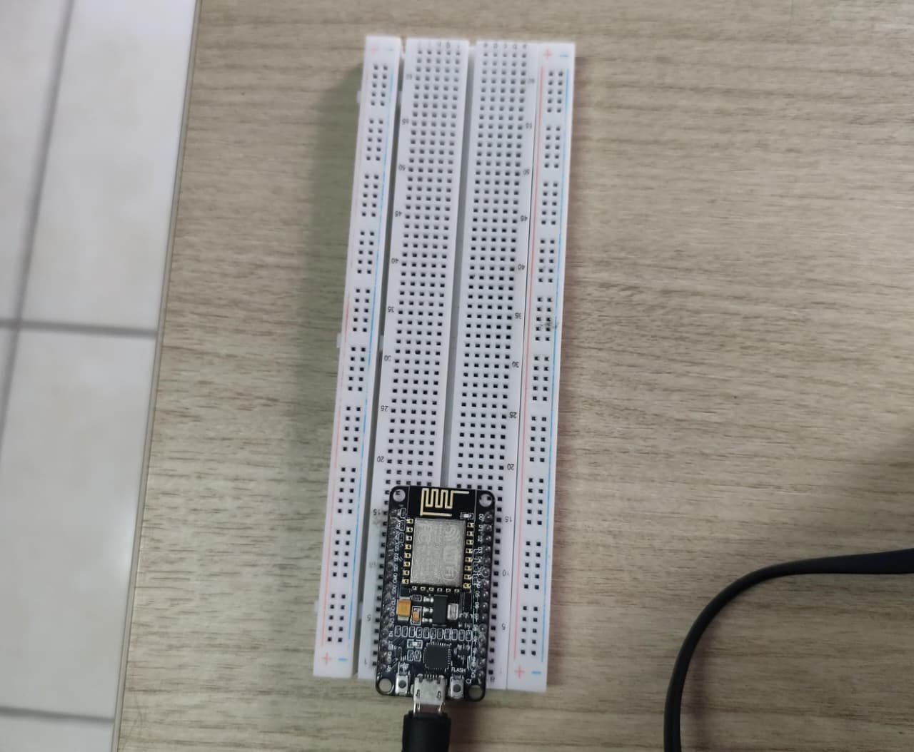

# Percobaan 2A: Konfigurasi Mode Station (STA)


## Tujuan
Memahami dan mengimplementasikan konfigurasi ESP32 pada mode Station (STA) agar
dapat terhubung ke jaringan WiFi yang sudah tersedia (misalnya router rumah atau
hotspot smartphone).

## Penjelasan Kode

```cpp
#include <ESP8266WiFi.h>
```
Import Library `ESP8266WiFi.h` bawaan ESP8266 yang menyediakan seluruh fungsi untuk
mengatur dan memantau koneksi jaringan WiFi, baik sebagai Station maupun Access
Point.

```cpp
const char* ssid     = "NAMA_WIFI_ANDA";
const char* password = "PASSWORD_WIFI_ANDA";
```
Menyimpan nama jaringan (SSID) dan password WiFi yang akan disambungi oleh ESP8266.

```cpp
const int ledPin = 2;
```
Menentukan pin GPIO 2 sebagai output untuk LED indikator status koneksi.

### Fungsi `setup()`

```cpp
Serial.begin(115200);
```
Mengaktifkan komunikasi serial dengan baud rate 115200 agar informasi proses
koneksi dapat ditampilkan di Serial Monitor Arduino IDE.

```cpp
pinMode(ledPin, OUTPUT);
digitalWrite(ledPin, LOW);
```
Mengatur pin LED sebagai output dan memastikan LED dalam kondisi mati (LOW) di
awal program, sebelum status koneksi diketahui.

```cpp
WiFi.mode(WIFI_STA);
```
Mengatur mode WiFi ESP8266 menjadi mode Station, yaitu ESP8266 berperan sebagai
client yang akan terhubung ke jaringan WIFI yang tersedia.

```cpp
WiFi.begin(ssid, password);
```
Memulai proses koneksi ke jaringan WiFi menggunakan SSID dan password yang
telah ditentukan.

```cpp
Serial.print("Menghubungkan ke WiFi");
while (WiFi.status() != WL_CONNECTED) {
  delay(500);
  Serial.print(".");
}
```
Program menunggu hingga status koneksi berubah menjadi `WL_CONNECTED`. Selama
belum terhubung, program mencetak tanda titik (`.`) setiap 500 ms sebagai
indikator visual bahwa proses koneksi sedang berlangsung.

```cpp
Serial.println();
Serial.println("WiFi berhasil terhubung!");
Serial.print("IP Address  : ");
Serial.println(WiFi.localIP());
Serial.print("MAC Address : ");
Serial.println(WiFi.macAddress());
Serial.print("RSSI (dBm)  : ");
Serial.println(WiFi.RSSI());
```
Setelah berhasil terhubung, program menampilkan tiga informasi :
- IP Address  
    alamat IP yang diberikan oleh DHCP server router kepada ESP32.
- MAC Address 
    alamat fisik unik dari modul WiFi ESP32.
- RSSI 
    kekuatan sinyal WiFi yang diterima ESP32, dalam satuan dBm (semakin mendekati 0, sinyal semakin kuat).

```cpp
digitalWrite(ledPin, HIGH);
```
Menyalakan LED sebagai indikator visual bahwa ESP32 telah berhasil terhubung
ke jaringan WiFi.

### Fungsi `loop()`

```cpp
if (WiFi.status() == WL_CONNECTED) {
    Serial.println("Status: Terhubung");
    Serial.print("IP Address  : ");
    Serial.println(WiFi.localIP());
    Serial.print("MAC Address : ");
    Serial.println(WiFi.macAddress());
    Serial.print("RSSI (dBm)  : ");
    Serial.println(WiFi.RSSI());
} else {
  Serial.println("Status: Terputus");
  digitalWrite(ledPin, LOW);
}
delay(5000);
```
Fungsi ini berjalan berulang setiap 5 detik (`delay(5000)`) untuk memeriksa status koneksi terkini. Jika masih terhubung, dicetak status "Terhubung" serta menampilkan informasi IP Address,MAC Address, dan RSSI. Jika koneksi putus, dicetak status "Terputus" dan LED dimatikan sebagai indikator.

## Ringkasan Alur Program
1. ESP32 diatur ke mode Station.
2. ESP32 mencoba konek ke WiFi menggunakan SSID/password yang ditentukan.
3. Program menunggu hingga koneksi berhasil, lalu menampilkan IP, MAC, dan RSSI.
4. LED menyala sebagai indikator koneksi berhasil.
5. Status koneksi terus dipantau setiap 5 detik selama program berjalan.
