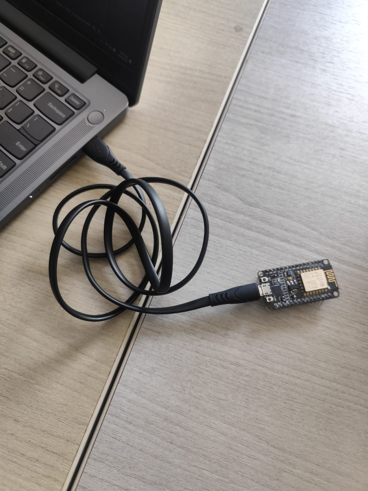

# Percobaan 3A: Pengiriman Data Sensor via HTTP POST (ESP8266)

## Tujuan
Memahami dan mengimplementasikan pengiriman data sensor dalam format JSON melalui protokol HTTP POST menggunakan ESP8266 ke server tujuan (https://httpbin.org/post) dengan koneksi HTTPS.

## Penjelasan Kode

```cpp
#include <ESP8266WiFi.h>
```
Library `ESP8266WiFi.h` bawaan ESP8266 yang menyediakan seluruh fungsi untuk mengatur dan memantau koneksi jaringan WiFi, baik sebagai Station maupun Access Point.

```cpp
#include <ESP8266HTTPClient.h>
```
Library `ESP8266HTTPClient.h` yang menyediakan class `HTTPClient` untuk melakukan komunikasi HTTP seperti `GET`, `POST`, `PUT`, dan `DELETE` ke server tujuan.

```cpp
#include <WiFiClientSecure.h>
```
Library `WiFiClientSecure.h` yang menyediakan class `WiFiClientSecure` untuk melakukan koneksi HTTPS (HTTP over TLS/SSL) yang terenkripsi. Dibutuhkan karena `serverUrl` menggunakan skema `https://`.

```cpp
#include <ArduinoJson.h>
```
Library `ArduinoJson.h` yang digunakan untuk membuat, mengolah, dan melakukan serialisasi data dalam format JSON dengan mudah dan efisien di memori mikrokontroler.

```cpp
const char *ssid = "wifi-anda";
const char *password = "password";
const char *serverUrl = "https://httpbin.org/post";
```
Menyimpan konfigurasi jaringan dan server tujuan:
- `ssid` : Nama jaringan (SSID) WiFi yang akan disambungkan oleh ESP8266.
- `password` : Password jaringan WiFi tersebut.
- `serverUrl` : URL endpoint server tujuan untuk menerima data POST. Pada percobaan ini menggunakan `https://httpbin.org/post` sebagai endpoint uji yang akan melakukan echo terhadap data yang dikirim.

### Fungsi `setup()`

```cpp
Serial.begin(115200);
```
Mengaktifkan komunikasi serial dengan baud rate 115200 agar informasi proses koneksi dan pengiriman data dapat ditampilkan di Serial Monitor Arduino IDE.

```cpp
WiFi.begin(ssid, password);
```
Memulai proses koneksi ke jaringan WiFi menggunakan SSID dan password yang telah ditentukan.

```cpp
Serial.print("Menghubungkan ke WiFi");
while (WiFi.status() != WL_CONNECTED) {
  delay(500);
  Serial.print(".");
}
```
Program menunggu hingga status koneksi berubah menjadi `WL_CONNECTED`. Selama belum terhubung, program mencetak tanda titik (`.`) setiap 500 ms sebagai indikator visual bahwa proses koneksi sedang berlangsung.

```cpp
Serial.println();
Serial.println("WiFi berhasil terhubung!");
```
Setelah berhasil terhubung, program menampilkan pesan konfirmasi bahwa ESP8266 telah berhasil terhubung ke jaringan WiFi dan siap melakukan pengiriman data.

### Fungsi `loop()`

```cpp
if (WiFi.status() == WL_CONNECTED) {
```
Memeriksa apakah ESP8266 masih terhubung dengan jaringan WiFi sebelum melakukan pengiriman data. Blok pengiriman HTTP hanya akan dieksekusi jika status `WL_CONNECTED`.

```cpp
HTTPClient http;
WiFiClientSecure client;
client.setInsecure();
```
- `HTTPClient http` : Membuat objek `HTTPClient` untuk menangani komunikasi HTTP.
- `WiFiClientSecure client` : Membuat objek client untuk komunikasi HTTPS.
- `client.setInsecure()` : Menonaktifkan pemeriksaan sertifikat SSL/TLS. Hal ini diperlukan agar ESP8266 dapat terhubung ke `https://httpbin.org` tanpa perlu menyertakan sertifikat root CA, cocok untuk tujuan pengujian/percobaan.

```cpp
http.begin(client, serverUrl);
http.addHeader("Content-Type", "application/json");
```
- `http.begin(client, serverUrl)` : Menghubungkan objek `HTTPClient` dengan server tujuan melalui client secure yang telah dibuat.
- `http.addHeader("Content-Type", "application/json")` : Menambahkan header HTTP yang menyatakan bahwa body data yang dikirim memiliki format `application/json`, sehingga server dapat menginterpretasikan data dengan benar.

```cpp
JsonDocument doc;
doc["suhu"] = 28.5;
doc["kelembaban"] = 65.0;
```
Membuat dokumen JSON untuk menampung data sensor:
- `JsonDocument doc` : Membuat objek dokumen JSON sebagai wadah data.
- `doc["suhu"] = 28.5` : Menambahkan pasangan key-value dengan key `"suhu"` dan value `28.5` (°C) sebagai contoh data suhu.
- `doc["kelembaban"] = 65.0` : Menambahkan pasangan key-value dengan key `"kelembaban"` dan value `65.0` (%) sebagai contoh data kelembaban.

```cpp
String requestBody;
serializeJson(doc, requestBody);
```
- `String requestBody` : Membuat variabel String untuk menyimpan hasil serialisasi JSON yang akan dikirim sebagai body HTTP.
- `serializeJson(doc, requestBody)` : Mengubah objek JSON (`doc`) menjadi string JSON dengan format `{"suhu":28.5,"kelembaban":65.0}` dan menyimpannya ke dalam `requestBody`.

```cpp
Serial.print("Mengirim data: ");
Serial.println(requestBody);
```
Menampilkan informasi di Serial Monitor bahwa data JSON akan dikirim, beserta isi data JSON tersebut untuk tujuan debugging dan verifikasi.

```cpp
int httpResponseCode = http.POST(requestBody);
```
Mengirim data JSON ke server menggunakan metode HTTP `POST`. Fungsi ini akan mengembalikan kode respons HTTP dari server (misalnya `200` untuk sukses).

```cpp
if (httpResponseCode > 0) {
  Serial.print("Kode Respon HTTP: ");
  Serial.println(httpResponseCode);
  Serial.println("Isi Respon:");
  Serial.println(http.getString());
} else {
  Serial.print("Pengiriman gagal, kode error: ");
  Serial.println(httpResponseCode);
}
```
Memeriksa hasil pengiriman:
- Jika `httpResponseCode > 0` (server memberikan respons valid) : Menampilkan kode respons HTTP dan isi respons dari server (`http.getString()`). Pada `httpbin.org/post`, isi respons berupa echo dari data JSON yang dikirim sebagai bukti pengiriman berhasil.
- Jika `httpResponseCode <= 0` (gagal) : Menampilkan pesan kegagalan beserta kode error (nilai negatif menandakan error koneksi, bukan dari server).

```cpp
http.end();
```
Mengakhiri koneksi HTTP dan membebaskan resource (memori dan koneksi TCP) yang digunakan oleh `HTTPClient`. Wajib dipanggil setiap selesai melakukan request agar tidak terjadi kebocoran memori.

```cpp
delay(10000);
```
Memberikan jeda 10 detik (10000 ms) sebelum proses pengiriman berikutnya diulang. Jeda ini berada di luar blok `if (WiFi.status() == WL_CONNECTED)`, sehingga tetap dieksekusi baik saat terhubung maupun tidak, untuk mencegah percobaan reconnect atau pengiriman yang terlalu rapat.

## Ringkasan Alur Program
1. ESP8266 melakukan inisialisasi Serial Monitor dan memulai koneksi ke jaringan WiFi menggunakan SSID dan password yang ditentukan.
2. Program menunggu hingga WiFi terhubung (`WL_CONNECTED`), lalu menampilkan pesan berhasil terhubung.
3. Di dalam `loop()`, program memeriksa status koneksi WiFi terlebih dahulu.
4. Jika terhubung, ESP8266 membuat client HTTPS (`WiFiClientSecure` dengan `setInsecure()`), menyiapkan objek `HTTPClient`, dan mengatur header `Content-Type: application/json`.
5. Data sensor simulasi (`suhu` dan `kelembaban`) disusun ke dalam objek JSON menggunakan `ArduinoJson`, lalu di-serialize menjadi string.
6. Data JSON dikirim ke `https://httpbin.org/post` melalui `http.POST()`.
7. Kode respons dan isi respons server ditampilkan di Serial Monitor sebagai verifikasi pengiriman.
8. Koneksi HTTP diakhiri dengan `http.end()`, kemudian program menunggu 10 detik sebelum mengulangi siklus pengiriman.
