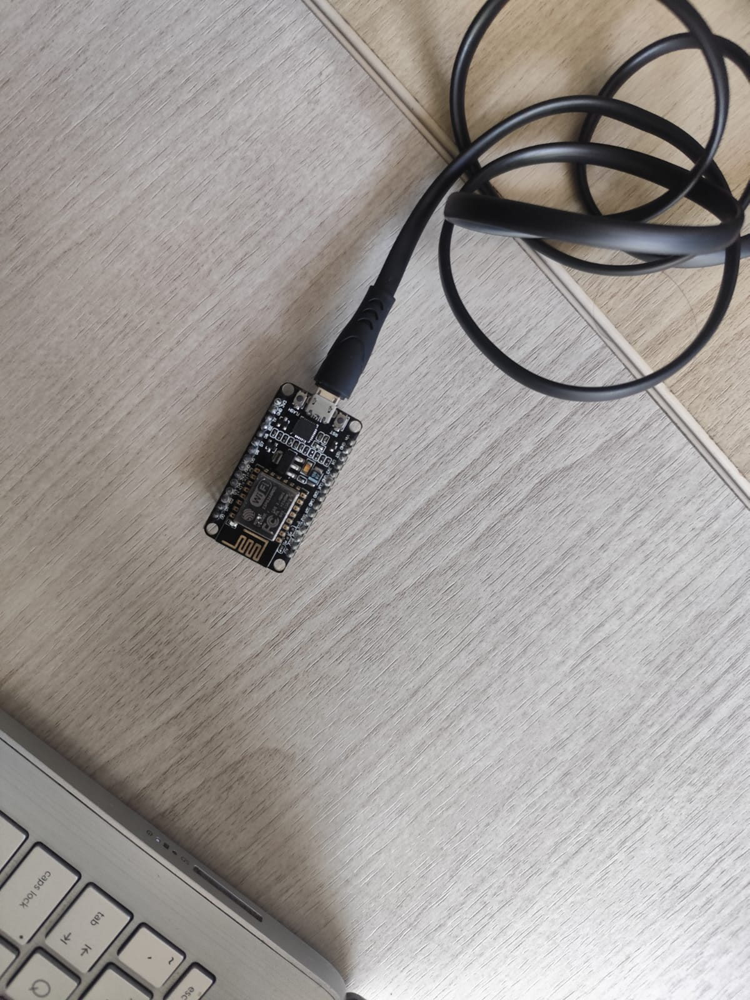

# Percobaan 3B: Pengiriman Data Sensor via MQTT dengan TLS (ESP8266)


## Tujuan
Memahami dan mengimplementasikan pengiriman data sensor dalam format JSON melalui protokol MQTT dengan koneksi aman TLS/SSL menggunakan ESP8266 ke broker MQTT (HiveMQ Cloud) dengan autentikasi username dan password.

## Penjelasan Kode

```cpp
#include <ESP8266WiFi.h>
```
Library `ESP8266WiFi.h` bawaan ESP8266 yang menyediakan seluruh fungsi untuk mengatur dan memantau koneksi jaringan WiFi, baik sebagai Station maupun Access Point.

```cpp
#include <WiFiClientSecure.h>
```
Library `WiFiClientSecure.h` yang menyediakan class `WiFiClientSecure` untuk melakukan koneksi aman berbasis TLS/SSL. Dibutuhkan karena broker MQTT menggunakan port `8883` (MQTT over TLS) yang terenkripsi.

```cpp
#include <PubSubClient.h>
```
Library `PubSubClient.h` yang menyediakan class `PubSubClient` untuk berkomunikasi dengan broker MQTT, meliputi fungsi `connect()`, `publish()`, `subscribe()`, dan `loop()` untuk menjaga koneksi tetap aktif.

```cpp
#include <ArduinoJson.h>
```
Library `ArduinoJson.h` yang digunakan untuk membuat, mengolah, dan melakukan serialisasi data dalam format JSON dengan mudah dan efisien di memori mikrokontroler.

```cpp
const char *ssid = "nama-wifi";
const char *password = "password";
const char *mqttServer = "mqtt.server";
const int mqttPort = 8883;
const char *mqttUsername = "test";
const char *mqttPassword = "12345678";
const char *mqttTopic = "test/sensor";
```
Menyimpan konfigurasi jaringan dan broker MQTT:
- `ssid` : Nama jaringan (SSID) WiFi yang akan disambungkan oleh ESP8266.
- `password` : Password jaringan WiFi tersebut.
- `mqttServer` : Alamat/host broker MQTT tujuan (misalnya `xxx.s1.eu.hivemq.cloud` pada HiveMQ Cloud).
- `mqttPort` : Port broker MQTT. Nilai `8883` merupakan port standar untuk MQTT dengan koneksi TLS/SSL.
- `mqttUsername` / `mqttPassword` : Kredensial untuk autentikasi ke broker MQTT.
- `mqttTopic` : Topik MQTT tempat data sensor akan di-publish (`test/sensor`).

```cpp
WiFiClientSecure espClient;
PubSubClient client(espClient);
```
- `WiFiClientSecure espClient` : Membuat objek client WiFi aman untuk koneksi TLS/SSL ke broker.
- `PubSubClient client(espClient)` : Membuat objek MQTT client yang menggunakan `espClient` sebagai transport layer, sehingga komunikasi MQTT berjalan di atas koneksi TLS.

### Fungsi `hubungkanWiFi()`

```cpp
WiFi.begin(ssid, password);
```
Memulai proses koneksi ke jaringan WiFi menggunakan SSID dan password yang telah ditentukan.

```cpp
Serial.print("Menghubungkan ke WiFi");
while (WiFi.status() != WL_CONNECTED) {
  delay(500);
  Serial.print(".");
}
```
Program menunggu hingga status koneksi berubah menjadi `WL_CONNECTED`. Selama belum terhubung, program mencetak tanda titik (`.`) setiap 500 ms sebagai indikator visual bahwa proses koneksi sedang berlangsung.

```cpp
Serial.println();
Serial.println("WiFi berhasil terhubung!");
Serial.print("IP Address: ");
Serial.println(WiFi.localIP());
```
Setelah berhasil terhubung, program menampilkan pesan konfirmasi beserta alamat IP yang diberikan oleh DHCP server router kepada ESP8266 melalui `WiFi.localIP()`.

### Fungsi `hubungkanMQTT()`

```cpp
while (!client.connected()) {
```
Melakukan perulangan selama ESP8266 belum berhasil terhubung dengan broker MQTT. Blok di dalamnya akan terus mencoba melakukan koneksi hingga berhasil.

```cpp
String clientId = "ESP8266Client-" + String(ESP.getChipId(), HEX);
Serial.print(" Client ID: ");
Serial.println(clientId);
```
Membuat Client ID unik untuk koneksi MQTT berdasarkan Chip ID ESP8266 (`ESP.getChipId()` dalam format HEX). Client ID harus unik untuk setiap perangkat yang terhubung ke broker yang sama. Nilai ini kemudian ditampilkan di Serial Monitor.

```cpp
if (client.connect(clientId.c_str(), mqttUsername, mqttPassword)) {
  Serial.println("MQTT berhasil terhubung!");
  Serial.print("Broker : ");
  Serial.println(mqttServer);
  Serial.print("Port   : ");
  Serial.println(mqttPort);
  Serial.println("================================");
}
```
Mencoba menghubungkan ESP8266 ke broker MQTT menggunakan Client ID, username, dan password:
- `client.connect()` : Mengembalikan `true` jika koneksi berhasil.
- Jika berhasil, program menampilkan pesan konfirmasi beserta alamat broker dan port yang digunakan.

```cpp
else {
  Serial.print("MQTT gagal, rc=");
  Serial.println(client.state());
  Serial.println("Mencoba lagi dalam 2 detik...");
  delay(2000);
}
```
Jika koneksi gagal:
- `client.state()` : Menampilkan kode status koneksi MQTT (return code) untuk diagnosa kegagalan (misalnya kegagalan autentikasi atau jaringan).
- Program menunggu 2 detik (`delay(2000)`) sebelum mencoba koneksi kembali, untuk menghindari percobaan koneksi yang terlalu rapat yang dapat membebani broker.

### Fungsi `setup()`

```cpp
Serial.begin(115200);
delay(1000);
Serial.println("================================");
Serial.println(" ESP8266 MQTT - HiveMQ Cloud");
Serial.println("================================");
```
Mengaktifkan komunikasi serial dengan baud rate 115200, memberi jeda 1 detik agar Serial stabil, kemudian menampilkan judul program di Serial Monitor sebagai header.

```cpp
hubungkanWiFi();
```
Memanggil fungsi `hubungkanWiFi()` untuk menghubungkan ESP8266 ke jaringan WiFi sebelum melakukan koneksi MQTT.

```cpp
espClient.setInsecure();
```
Menonaktifkan pemeriksaan sertifikat TLS/SSL pada `WiFiClientSecure`. Hal ini diperlukan agar ESP8266 dapat terhubung ke broker HiveMQ Cloud tanpa perlu menyertakan sertifikat root CA, cocok untuk tujuan pengujian/percobaan.

```cpp
client.setServer(mqttServer, mqttPort);
```
Mengatur alamat broker MQTT dan port yang akan digunakan oleh objek `PubSubClient`. Fungsi ini harus dipanggil sebelum `client.connect()`.

```cpp
hubungkanMQTT();
```
Memanggil fungsi `hubungkanMQTT()` untuk melakukan koneksi awal ke broker MQTT setelah WiFi dan konfigurasi TLS selesai.

### Fungsi `loop()`

```cpp
if (!client.connected()) {
  Serial.println("MQTT terputus!");
  hubungkanMQTT();
}
```
Memeriksa apakah koneksi MQTT masih aktif sebelum melakukan publish. Jika `client.connected()` bernilai `false` (koneksi terputus), program menampilkan pesan dan memanggil `hubungkanMQTT()` untuk melakukan reconnect.

```cpp
client.loop();
```
Menjaga koneksi MQTT tetap aktif dan menangani komunikasi MQTT di background (keep-alive, menerima pesan, dan mengelola retransmisi). Fungsi ini wajib dipanggil secara periodik di setiap iterasi `loop()`.

```cpp
JsonDocument doc;
doc["suhu"] = 28.5;
doc["kelembaban"] = 65.0;
```
Membuat dokumen JSON untuk menampung data sensor:
- `JsonDocument doc` : Membuat objek dokumen JSON sebagai wadah data.
- `doc["suhu"] = 28.5` : Menambahkan pasangan key-value dengan key `"suhu"` dan value `28.5` (°C) sebagai contoh data suhu.
- `doc["kelembaban"] = 65.0` : Menambahkan pasangan key-value dengan key `"kelembaban"` dan value `65.0` (%) sebagai contoh data kelembaban.

```cpp
char buffer[128];
serializeJson(doc, buffer);
```
- `char buffer[128]` : Membuat array karakter berukuran 128 byte untuk menyimpan hasil serialisasi JSON.
- `serializeJson(doc, buffer)` : Mengubah objek JSON (`doc`) menjadi string JSON dengan format `{"suhu":28.5,"kelembaban":65.0}` dan menyimpannya ke dalam `buffer`.

```cpp
bool berhasil = client.publish(mqttTopic, buffer);
```
Mengirim data JSON ke broker MQTT pada topik yang telah ditentukan:
- `client.publish(mqttTopic, buffer)` : Melakukan publish payload `buffer` ke `mqttTopic`. Fungsi mengembalikan `true` jika publish berhasil diantrikan untuk dikirim.
- Hasil pengiriman disimpan dalam variabel `berhasil` bertipe `bool`.

```cpp
if (berhasil) {
  Serial.println("Data berhasil dikirim!");
  Serial.print("Topic   : ");
  Serial.println(mqttTopic);
  Serial.print("Payload : ");
  Serial.println(buffer);
} else {
  Serial.println("Gagal mengirim data!");
}
```
Memeriksa hasil publish:
- Jika `berhasil == true` : Menampilkan pesan sukses beserta topik dan payload JSON yang dikirim untuk verifikasi.
- Jika `berhasil == false` : Menampilkan pesan kegagalan pengiriman (misalnya karena koneksi terputus atau buffer penuh).

```cpp
delay(5000);
```
Memberikan jeda 5 detik (5000 ms) sebelum proses pengiriman berikutnya diulang, untuk mengatur interval publish data agar tidak membanjiri broker dan memberi waktu `client.loop()` bekerja optimal.

## Ringkasan Alur Program
1. ESP8266 melakukan inisialisasi Serial Monitor dan menampilkan header program `ESP8266 MQTT - HiveMQ Cloud`.
2. ESP8266 menghubungkan diri ke jaringan WiFi melalui `hubungkanWiFi()` dan menampilkan IP Address setelah berhasil terhubung.
3. Konfigurasi TLS diatur dengan `espClient.setInsecure()` dan broker MQTT diatur via `client.setServer()`.
4. ESP8266 melakukan koneksi ke broker MQTT melalui `hubungkanMQTT()` dengan Client ID unik (`ESP.getChipId()`), username, dan password. Jika gagal, percobaan diulang setiap 2 detik.
5. Di dalam `loop()`, program memeriksa status koneksi MQTT; jika terputus, dilakukan reconnect otomatis.
6. `client.loop()` dipanggil untuk menjaga koneksi MQTT tetap hidup.
7. Data sensor simulasi (`suhu` dan `kelembaban`) disusun ke dalam objek JSON menggunakan `ArduinoJson`, lalu di-serialize ke `buffer` dengan format `{"suhu":28.5,"kelembaban":65.0}`.
8. Data JSON di-publish ke topik `test/sensor` melalui `client.publish()`, kemudian hasil pengiriman (berhasil/gagal) ditampilkan di Serial Monitor.
9. Program menunggu 5 detik sebelum mengulangi siklus pengiriman berikutnya.
