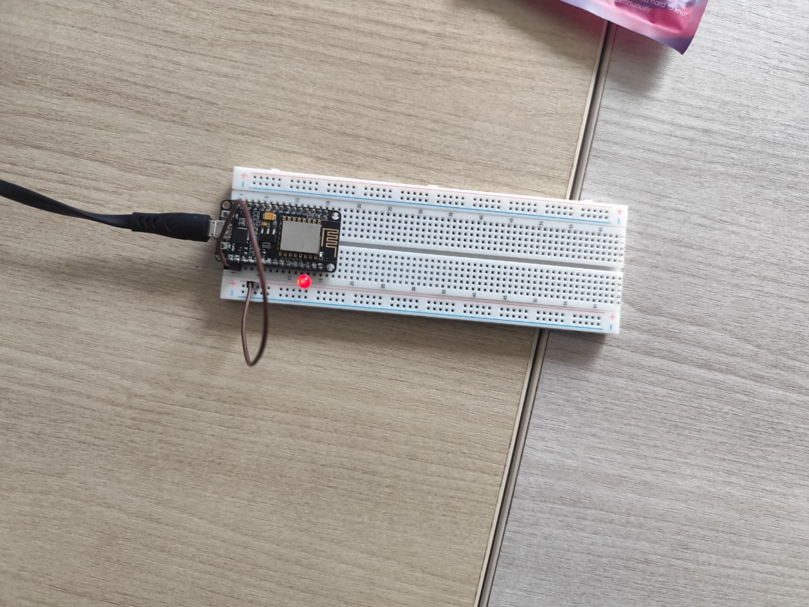

# Percobaan 4A: Penerimaan Perintah Aktuator via MQTT Subscribe dengan TLS (ESP8266)

## Tujuan
Memahami dan mengimplementasikan penerimaan perintah aktuator dalam format JSON melalui protokol MQTT dengan koneksi aman TLS/SSL menggunakan ESP8266 dari broker MQTT (broker.hivemq.com) untuk mengendalikan LED berdasarkan kunci `perintah` (`ON`/`OFF`).

## Penjelasan Kode

```cpp
#include <ESP8266WiFi.h>
```
Library `ESP8266WiFi.h` ESP8266 yang menyediakan seluruh fungsi untuk mengatur dan memantau koneksi jaringan WiFi, baik sebagai Station maupun Access Point.

```cpp
#include <WiFiClientSecure.h>
```
Library `WiFiClientSecure.h` yang menyediakan class `WiFiClientSecure` untuk melakukan koneksi aman berbasis TLS/SSL. Dibutuhkan karena broker MQTT menggunakan port `8883` (MQTT over TLS) yang terenkripsi.

```cpp
#include <PubSubClient.h>
```
Library `PubSubClient.h` yang menyediakan class `PubSubClient` untuk berkomunikasi dengan broker MQTT, meliputi fungsi `connect()`, `publish()`, `subscribe()`, `loop()`, serta pengaturan server dan callback untuk pesan masuk.

```cpp
#include <ArduinoJson.h>
```
Library `ArduinoJson.h` yang digunakan untuk membuat, mengolah, dan melakukan deserialisasi data dalam format JSON dengan mudah dan efisien di memori mikrokontroler.

```cpp
const char *ssid = "nama-wifi";
const char *password = "password";
```
Menyimpan konfigurasi jaringan WiFi:
- `ssid` : Nama jaringan (SSID) WiFi yang akan disambungkan oleh ESP8266.
- `password` : Password jaringan WiFi tersebut.

```cpp
const char *mqttServer = "broker.hivemq.com";
const int mqttPort = 8883;
const char *topicPerintah = "test/sensor";
```
Menyimpan konfigurasi broker dan topik MQTT:
- `mqttServer` : Alamat/host broker MQTT tujuan. Pada percobaan ini menggunakan `broker.hivemq.com`.
- `mqttPort` : Port broker MQTT. Nilai `8883` merupakan port standar untuk MQTT dengan koneksi TLS/SSL.
- `topicPerintah` : Topik MQTT yang di-subscribe untuk menerima perintah aktuator (`test/sensor`).

```cpp
const char *mqttUsername = "test";
const char *mqttPassword = "12345678";
const int ledPin = 4;
```
Menyimpan kredensial dan konfigurasi hardware:
- `mqttUsername` / `mqttPassword` : Kredensial untuk autentikasi ke broker MQTT.
- `ledPin` : Pin aktuator LED (GPIO4/D2) yang akan dikendalikan berdasarkan perintah yang diterima.

```cpp
WiFiClientSecure espClient;
PubSubClient client(espClient);
```
- `WiFiClientSecure espClient` : Membuat objek client WiFi aman untuk koneksi TLS/SSL ke broker.
- `PubSubClient client(espClient)` : Membuat objek MQTT client yang menggunakan `espClient` sebagai transport layer, sehingga komunikasi MQTT berjalan di atas koneksi TLS.

### Fungsi `callback()`

```cpp
void callback(char *topic, byte *payload, unsigned int length)
```
Fungsi callback yang dipanggil otomatis setiap ada pesan baru masuk pada topik yang di-subscribe:
- `topic` : Nama topik tempat pesan diterima.
- `payload` : Isi pesan dalam bentuk byte array.
- `length` : Panjang pesan (jumlah byte).

```cpp
String pesan;
for (unsigned int i = 0; i < length; i++)
{
  pesan += (char)payload[i];
}
```
Mengubah payload byte-array menjadi `String` Arduino dengan mengkonversi setiap byte menjadi karakter satu per satu, agar mudah ditampilkan dan di-parsing sebagai JSON.

```cpp
Serial.print("Pesan diterima [");
Serial.print(topic);
Serial.print("]: ");
Serial.println(pesan);
```
Menampilkan pesan mentah yang diterima di Serial Monitor beserta nama topiknya untuk tujuan debugging dan verifikasi.

```cpp
JsonDocument doc;
DeserializationError error = deserializeJson(doc, pesan);
if (error)
{
  Serial.print("Gagal parsing JSON: ");
  Serial.println(error.c_str());
  return;
}
```
Melakukan deserialisasi data JSON yang diterima, contoh: `{"perintah":"ON"}`:
- `JsonDocument doc` : Membuat objek dokumen JSON sebagai wadah hasil parsing.
- `deserializeJson(doc, pesan)` : Mengubah string `pesan` menjadi objek JSON. Mengembalikan objek `DeserializationError` yang bernilai `true` bila gagal.
- Jika `error` (format JSON salah) : Menampilkan pesan kegagalan beserta deskripsi error (`error.c_str()`) lalu `return` agar tidak memproses data yang tidak valid.

```cpp
const char *perintah = doc["perintah"];
if (String(perintah) == "ON")
{
  digitalWrite(ledPin, HIGH);
  Serial.println("Aktuator: ON");
}
else if (String(perintah) == "OFF")
{
  digitalWrite(ledPin, LOW);
  Serial.println("Aktuator: OFF");
}
```
Mengambil nilai kunci `"perintah"` dari JSON dan mengendalikan aktuator LED:
- `doc["perintah"]` : Membaca nilai kunci `"perintah"` (misalnya `"ON"` atau `"OFF"`).
- Jika `"ON"` : Menyalakan LED dengan `digitalWrite(ledPin, HIGH)` dan menampilkan `Aktuator: ON` di Serial Monitor.
- Jika `"OFF"` : Mematikan LED dengan `digitalWrite(ledPin, LOW)` dan menampilkan `Aktuator: OFF` di Serial Monitor.

### Fungsi `hubungkanWiFi()`

```cpp
WiFi.begin(ssid, password);
```
Memulai proses koneksi ke jaringan WiFi menggunakan SSID dan password yang telah ditentukan.

```cpp
Serial.print("Menghubungkan ke WiFi");
while (WiFi.status() != WL_CONNECTED) {
  delay(500);
  Serial.print(".");
}
```
Program menunggu hingga status koneksi berubah menjadi `WL_CONNECTED`. Selama belum terhubung, program mencetak tanda titik (`.`) setiap 500 ms sebagai indikator visual bahwa proses koneksi sedang berlangsung.

```cpp
Serial.println("\nWiFi berhasil terhubung!");
```
Setelah berhasil terhubung, program menampilkan pesan konfirmasi bahwa ESP8266 telah berhasil terhubung ke jaringan WiFi dan siap melakukan koneksi MQTT.

### Fungsi `hubungkanMQTT()`

```cpp
while (!client.connected()) {
```
Melakukan perulangan selama ESP8266 belum berhasil terhubung dengan broker MQTT. Blok di dalamnya akan terus mencoba melakukan koneksi hingga berhasil.

```cpp
String clientId = "ESP32Client-" + String(random(0xffff), HEX);
```
Membuat Client ID acak agar tidak bentrok dengan client lain yang terhubung ke broker yang sama. Nilai acak diambil dari rentang `0x0000`–`0xFFFF` dalam format HEX.

```cpp
if (client.connect(clientId.c_str(), mqttUsername, mqttPassword))
{
  Serial.println("berhasil terhubung!");
  client.subscribe(topicPerintah);
  Serial.print("Subscribe ke topic: ");
  Serial.println(topicPerintah);
}
```
Mencoba menghubungkan ESP8266 ke broker MQTT menggunakan Client ID, username, dan password:
- `client.connect()` : Mengembalikan `true` jika koneksi berhasil.
- Jika berhasil, program menampilkan pesan konfirmasi lalu melakukan `subscribe` ke `topicPerintah` agar dapat menerima perintah aktuator.

```cpp
else
{
  Serial.print("gagal, rc=");
  Serial.print(client.state());
  Serial.println(" coba lagi dalam 2 detik");
  delay(2000);
}
```
Jika koneksi gagal:
- `client.state()` : Menampilkan kode status koneksi MQTT (return code) untuk diagnosa kegagalan (misalnya kegagalan autentikasi atau jaringan).
- Program menunggu 2 detik (`delay(2000)`) sebelum mencoba koneksi kembali, untuk menghindari percobaan koneksi yang terlalu rapat.

### Fungsi `setup()`

```cpp
espClient.setInsecure();
```
Menonaktifkan pemeriksaan sertifikat TLS/SSL pada `WiFiClientSecure`. Hal ini diperlukan agar ESP8266 dapat terhubung ke broker HiveMQ tanpa perlu menyertakan sertifikat root CA, cocok untuk tujuan pengujian/percobaan.

```cpp
Serial.begin(115200);
```
Mengaktifkan komunikasi serial dengan baud rate 115200 agar informasi proses koneksi dan pesan yang diterima dapat ditampilkan di Serial Monitor Arduino IDE.

```cpp
pinMode(ledPin, OUTPUT);
digitalWrite(ledPin, LOW);
```
- `pinMode(ledPin, OUTPUT)` : Mengatur pin LED sebagai output agar dapat dikendalikan dengan `digitalWrite()`.
- `digitalWrite(ledPin, LOW)` : Memastikan kondisi awal LED mati saat board pertama menyala.

```cpp
hubungkanWiFi();
```
Memanggil fungsi `hubungkanWiFi()` untuk menghubungkan ESP8266 ke jaringan WiFi sebelum melakukan koneksi MQTT.

```cpp
client.setServer(mqttServer, mqttPort);
client.setCallback(callback);
```
- `client.setServer(mqttServer, mqttPort)` : Mengatur alamat broker MQTT dan port yang akan digunakan oleh objek `PubSubClient`. Fungsi ini harus dipanggil sebelum `client.connect()`.
- `client.setCallback(callback)` : Mendaftarkan fungsi `callback()` sebagai penangan pesan masuk, sehingga setiap pesan pada topik yang di-subscribe diteruskan ke fungsi tersebut.

### Fungsi `loop()`

```cpp
if (!client.connected()) {
  hubungkanMQTT();
}
```
Memeriksa apakah koneksi MQTT masih aktif. Jika `client.connected()` bernilai `false` (koneksi terputus atau belum pernah terhubung), program memanggil `hubungkanMQTT()` untuk melakukan (re)connect dan subscribe ulang.

```cpp
client.loop();
```
Menjaga koneksi MQTT tetap aktif dan menangani komunikasi MQTT di background (keep-alive dan menerima pesan masuk). Fungsi ini wajib dipanggil terus-menerus di setiap iterasi `loop()` agar pesan subscribe dapat diterima dan diteruskan ke `callback()`.

## Ringkasan Alur Program
1. ESP8266 melakukan inisialisasi `WiFiClientSecure` (mode insecure), Serial Monitor, dan pin LED sebagai output dengan kondisi awal mati.
2. ESP8266 menghubungkan diri ke jaringan WiFi melalui `hubungkanWiFi()` hingga status `WL_CONNECTED`.
3. Broker MQTT diatur via `client.setServer()` dan fungsi `callback()` didaftarkan via `client.setCallback()`.
4. Di dalam `loop()`, program memastikan koneksi MQTT aktif; jika putus, dilakukan reconnect melalui `hubungkanMQTT()` dengan Client ID acak, username, dan password, lalu subscribe ke topik `test/sensor`.
5. `client.loop()` dipanggil terus-menerus untuk menjaga koneksi dan menerima pesan masuk.
6. Setiap pesan yang masuk diteruskan ke `callback()`, yang mengubah payload menjadi String, menampilkannya di Serial Monitor, dan mem-parsing-nya sebagai JSON.
7. Nilai kunci `"perintah"` dibaca dari JSON: `"ON"` menyalakan LED (`HIGH`), `"OFF"` mematikan LED (`LOW`), beserta pesan status aktuator di Serial Monitor. Pesan berformat JSON salah diabaikan setelah menampilkan error parsing.
