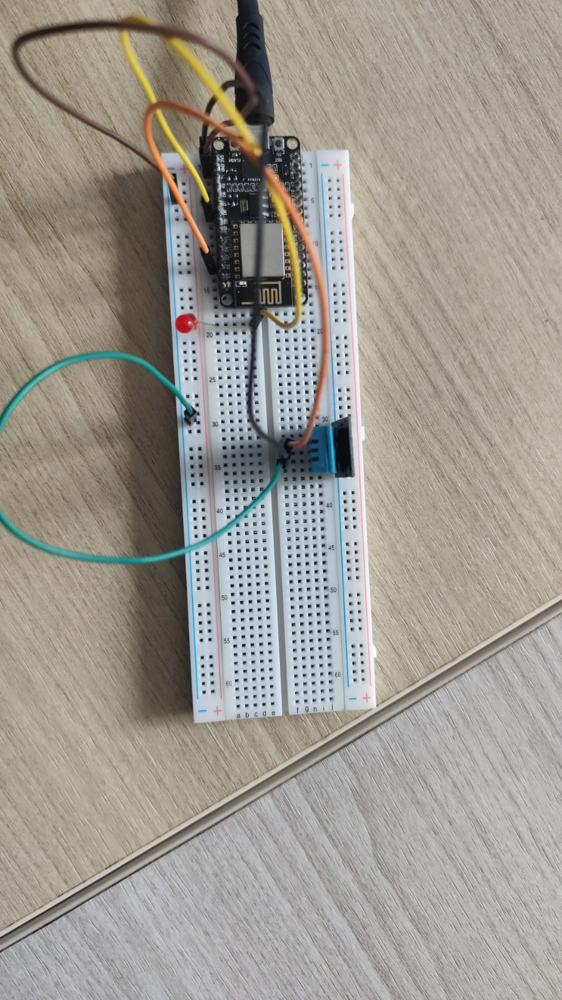

# Percobaan 4B: Komunikasi MQTT Dua Arah Publish-Subscribe dengan TLS (ESP8266)

## Tujuan
Memahami dan mengimplementasikan komunikasi MQTT dua arah menggunakan ESP8266 ke broker MQTT (broker.hivemq.com) dengan koneksi aman TLS/SSL, yaitu mem-publish data sensor suhu dalam format JSON sekaligus men-subscribe perintah aktuator dalam format JSON untuk mengendalikan LED.

## Penjelasan Kode

```cpp
#include <ESP8266WiFi.h>
```
Library `ESP8266WiFi.h` bawaan ESP8266 yang menyediakan seluruh fungsi untuk mengatur dan memantau koneksi jaringan WiFi, baik sebagai Station maupun Access Point.

```cpp
#include <PubSubClient.h>
```
Library `PubSubClient.h` yang menyediakan class `PubSubClient` untuk berkomunikasi dengan broker MQTT, meliputi fungsi `connect()`, `publish()`, `subscribe()`, `loop()`, serta pengaturan server dan callback untuk pesan masuk.

```cpp
#include <WiFiClientSecure.h>
```
Library `WiFiClientSecure.h` yang menyediakan class `WiFiClientSecure` untuk melakukan koneksi aman berbasis TLS/SSL. Dibutuhkan karena broker MQTT menggunakan port `8883` (MQTT over TLS) yang terenkripsi, bukan `1883`.

```cpp
#include <ArduinoJson.h>
```
Library `ArduinoJson.h` yang digunakan untuk membuat, mengolah, dan melakukan serialisasi serta deserialisasi data dalam format JSON dengan mudah dan efisien di memori mikrokontroler.

```cpp
#include <DHT.h>
```
Library `DHT.h` yang digunakan untuk membaca data dari sensor suhu dan kelembaban keluarga DHT (DHT11/DHT22), meliputi inisialisasi sensor dan fungsi pembacaan suhu.

```cpp
const char *ssid = "Crzx";
const char *password = "CrzxaExe3";
```
Menyimpan konfigurasi jaringan WiFi:
- `ssid` : Nama jaringan (SSID) WiFi yang akan disambungkan oleh ESP8266.
- `password` : Password jaringan WiFi tersebut.

```cpp
const char *mqttServer = "broker.hivemq.com";
const int mqttPort = 8883;
const char *topicData = "test/data";
const char *topicPerintah = "test/sensor";
```
Menyimpan konfigurasi broker dan topik MQTT:
- `mqttServer` : Alamat/host broker MQTT tujuan. Pada percobaan ini menggunakan `broker.hivemq.com` (broker publik HiveMQ untuk pengujian).
- `mqttPort` : Port broker MQTT. Nilai `8883` merupakan port standar untuk MQTT dengan koneksi TLS/SSL.
- `topicData` : Topik MQTT untuk mem-publish data sensor (`test/data`).
- `topicPerintah` : Topik MQTT untuk men-subscribe perintah aktuator (`test/sensor`).

```cpp
const char *mqttUsername = "test";
const char *mqttPassword = "12345678";
```
Menyimpan kredensial MQTT:
- `mqttUsername` / `mqttPassword` : Kredensial untuk autentikasi ke broker MQTT.

```cpp
#define DHTPIN 2
#define DHTTYPE DHT11
const int ledPin = 12;
```
Menyimpan konfigurasi hardware sensor dan aktuator:
- `DHTPIN` : Pin data sensor DHT (GPIO2/D4).
- `DHTTYPE` : Tipe sensor yang dipakai (`DHT11`).
- `ledPin` : Pin aktuator LED (GPIO12/D6) yang dikendalikan berdasarkan perintah yang diterima.

```cpp
DHT dht(DHTPIN, DHTTYPE);
WiFiClientSecure espClient;
PubSubClient client(espClient);
unsigned long waktuTerakhirPublish = 0;
const long intervalPublish = 5000;
```
- `DHT dht(DHTPIN, DHTTYPE)` : Membuat objek sensor DHT dengan pin dan tipe yang telah ditentukan.
- `WiFiClientSecure espClient` : Membuat objek client WiFi aman untuk koneksi TLS/SSL ke broker.
- `PubSubClient client(espClient)` : Membuat objek MQTT client yang menggunakan `espClient` sebagai transport layer, sehingga komunikasi MQTT berjalan di atas koneksi TLS.
- `waktuTerakhirPublish` : Menyimpan waktu (millis) publish terakhir untuk penjadwalan non-blocking.
- `intervalPublish` : Interval publish data sensor setiap 5 detik (5000 ms) secara non-blocking.

### Fungsi `callback()`

```cpp
void callback(char *topic, byte *payload, unsigned int length)
```
Fungsi callback yang dipanggil otomatis setiap ada pesan baru masuk pada topik yang di-subscribe:
- `topic` : Nama topik tempat pesan diterima.
- `payload` : Isi pesan dalam bentuk byte array.
- `length` : Panjang pesan (jumlah byte).

```cpp
String pesan;
for (unsigned int i = 0; i < length; i++)
  pesan += (char)payload[i];
```
Mengubah payload byte-array menjadi `String` Arduino dengan mengkonversi setiap byte menjadi karakter satu per satu, agar mudah di-parsing sebagai JSON.

```cpp
JsonDocument doc;
if (deserializeJson(doc, pesan))
  return;
```
Melakukan deserialisasi JSON, contoh: `{"perintah":"ON"}`:
- `JsonDocument doc` : Membuat objek dokumen JSON sebagai wadah hasil parsing.
- `deserializeJson(doc, pesan)` : Mengubah string `pesan` menjadi objek JSON. Jika parsing gagal (return value non-nol), program langsung `return` sehingga pesan berformat salah diabaikan.

```cpp
const char *perintah = doc["perintah"];
digitalWrite(ledPin, String(perintah) == "ON" ? HIGH : LOW);
Serial.print("Perintah diterima -> Aktuator: ");
Serial.println(perintah);
```
Mengambil nilai kunci `"perintah"` dan mengendalikan LED:
- `doc["perintah"]` : Membaca nilai kunci `"perintah"` (misalnya `"ON"` atau `"OFF"`).
- `digitalWrite(ledPin, ...)` : Menyalakan LED (`HIGH`) bila perintah `"ON"`, dan mematikannya (`LOW`) bila selain itu (misalnya `"OFF"`), menggunakan operator ternary.
- Program kemudian menampilkan perintah yang diterima beserta status aktuator di Serial Monitor.

### Fungsi `hubungkanWiFi()`

```cpp
WiFi.begin(ssid, password);
```
Memulai proses koneksi ke jaringan WiFi menggunakan SSID dan password yang telah ditentukan.

```cpp
while (WiFi.status() != WL_CONNECTED)
  delay(500);
```
Program menunggu hingga status koneksi berubah menjadi `WL_CONNECTED`. Selama belum terhubung, program menunggu dengan jeda 500 ms di setiap pengecekan.

```cpp
Serial.println("WiFi berhasil terhubung!");
```
Setelah berhasil terhubung, program menampilkan pesan konfirmasi bahwa ESP8266 telah berhasil terhubung ke jaringan WiFi dan siap melakukan koneksi MQTT.

### Fungsi `hubungkanMQTT()`

```cpp
while (!client.connected()) {
```
Melakukan perulangan selama ESP8266 belum berhasil terhubung dengan broker MQTT. Blok di dalamnya akan terus mencoba melakukan koneksi hingga berhasil.

```cpp
String clientId = "ESP32Client-" + String(random(0xffff), HEX);
```
Membuat Client ID acak agar tidak bentrok dengan client lain yang terhubung ke broker yang sama. Nilai acak diambil dari rentang `0x0000`–`0xFFFF` dalam format HEX.

```cpp
if (client.connect(clientId.c_str(), mqttUsername, mqttPassword))
{
  client.subscribe(topicPerintah);
  Serial.println("Terhubung dan subscribe topic perintah");
}
```
Mencoba menghubungkan ESP8266 ke broker MQTT menggunakan Client ID, username, dan password:
- `client.connect()` : Mengembalikan `true` jika koneksi berhasil.
- Jika berhasil, program melakukan `subscribe` ke `topicPerintah` agar dapat menerima perintah aktuator, lalu menampilkan pesan konfirmasi di Serial Monitor.

```cpp
else
{
  delay(2000);
}
```
Jika koneksi gagal, program menunggu 2 detik (`delay(2000)`) sebelum mencoba koneksi kembali, untuk menghindari percobaan koneksi yang terlalu rapat yang dapat membebani broker.

### Fungsi `setup()`

```cpp
espClient.setInsecure();
```
Menonaktifkan pemeriksaan sertifikat TLS/SSL pada `WiFiClientSecure`. Hal ini diperlukan agar ESP8266 dapat terhubung ke broker HiveMQ tanpa perlu menyertakan sertifikat root CA, cocok untuk tujuan pengujian/percobaan.

```cpp
Serial.begin(115200);
```
Mengaktifkan komunikasi serial dengan baud rate 115200 agar informasi proses koneksi, data terkirim, dan perintah diterima dapat ditampilkan di Serial Monitor Arduino IDE.

```cpp
pinMode(ledPin, OUTPUT);
dht.begin();
```
- `pinMode(ledPin, OUTPUT)` : Mengatur pin LED sebagai output agar dapat dikendalikan dengan `digitalWrite()`.
- `dht.begin()` : Menginisialisasi sensor DHT agar siap melakukan pembacaan suhu.

```cpp
hubungkanWiFi();
```
Memanggil fungsi `hubungkanWiFi()` untuk menghubungkan ESP8266 ke jaringan WiFi sebelum melakukan koneksi MQTT.

```cpp
client.setServer(mqttServer, mqttPort);
client.setCallback(callback);
```
- `client.setServer(mqttServer, mqttPort)` : Mengatur alamat broker MQTT dan port yang akan digunakan oleh objek `PubSubClient`. Fungsi ini harus dipanggil sebelum `client.connect()`.
- `client.setCallback(callback)` : Mendaftarkan fungsi `callback()` sebagai penangan pesan masuk, sehingga setiap pesan pada topik yang di-subscribe diteruskan ke fungsi tersebut.

### Fungsi `loop()`

```cpp
if (!client.connected())
  hubungkanMQTT();
```
Memeriksa apakah koneksi MQTT masih aktif. Jika `client.connected()` bernilai `false` (koneksi terputus atau belum pernah terhubung), program memanggil `hubungkanMQTT()` untuk melakukan (re)connect dan subscribe ulang.

```cpp
client.loop();
```
Menjaga koneksi MQTT tetap aktif dan menangani komunikasi MQTT di background (keep-alive dan menerima pesan masuk). Fungsi ini wajib dipanggil terus-menerus di setiap iterasi `loop()` agar pesan subscribe dapat diterima dan publish tetap berjalan.

```cpp
if (millis() - waktuTerakhirPublish > intervalPublish) {
  waktuTerakhirPublish = millis();
```
Melakukan publish data sensor secara berkala tanpa memblokir proses subscribe:
- `millis() - waktuTerakhirPublish > intervalPublish` : Mengecek apakah sudah lewat 5 detik sejak publish terakhir (penjadwalan non-blocking, tidak memakai `delay()`).
- `waktuTerakhirPublish = millis()` : Menyimpan waktu publish terakhir sebagai acuan siklus berikutnya.

```cpp
float suhu = dht.readTemperature();
if (!isnan(suhu)) {
```
- `dht.readTemperature()` : Membaca suhu dari sensor DHT.
- `!isnan(suhu)` : Memastikan bacaan valid (bukan `NaN`). Blok publish hanya dieksekusi jika pembacaan sensor berhasil.

```cpp
JsonDocument doc;
doc["suhu"] = random(24, 30);
```
Membuat objek JSON untuk payload:
- `JsonDocument doc` : Membuat objek dokumen JSON sebagai wadah data.
- `doc["suhu"] = random(24, 30)` : Mengisi data suhu (simulasi nilai acak 24–29 derajat). Nilai acak dipakai sebagai pengganti `suhu` hasil bacaan sensor pada kode ini.

```cpp
char buffer[128];
serializeJson(doc, buffer);
```
- `char buffer[128]` : Membuat array karakter berukuran 128 byte untuk menyimpan hasil serialisasi JSON.
- `serializeJson(doc, buffer)` : Mengubah objek JSON (`doc`) menjadi string JSON dengan format misalnya `{"suhu":27}` dan menyimpannya ke dalam `buffer`.

```cpp
client.publish(topicData, buffer);
Serial.print("Data terkirim: ");
Serial.println(buffer);
```
- `client.publish(topicData, buffer)` : Mengirim (publish) payload JSON ke topik `test/data`.
- Program kemudian menampilkan payload yang terkirim di Serial Monitor untuk verifikasi.

## Ringkasan Alur Program
1. ESP8266 melakukan inisialisasi `WiFiClientSecure` (mode insecure), Serial Monitor, pin LED sebagai output, dan sensor DHT melalui `dht.begin()`.
2. ESP8266 menghubungkan diri ke jaringan WiFi melalui `hubungkanWiFi()` hingga status `WL_CONNECTED`.
3. Broker MQTT diatur via `client.setServer()` dan fungsi `callback()` didaftarkan via `client.setCallback()`.
4. Di dalam `loop()`, program memastikan koneksi MQTT aktif; jika putus, dilakukan reconnect melalui `hubungkanMQTT()` dengan Client ID acak dan subscribe ke topik `test/sensor`.
5. `client.loop()` dipanggil terus-menerus untuk menjaga koneksi dan menerima pesan subscribe tanpa terblokir.
6. Setiap pesan masuk diteruskan ke `callback()`, yang mem-parsing JSON dan mengendalikan LED: `"ON"` menyalakan LED (`HIGH`), selain itu mematikan LED (`LOW`). Pesan berformat JSON salah diabaikan.
7. Secara paralel non-blocking setiap 5 detik (`millis()`), ESP8266 membaca sensor DHT, menyusun data suhu ke objek JSON, men-serialize ke `buffer`, lalu mem-publish ke topik `test/data` dan menampilkannya di Serial Monitor.
8. Siklus subscribe (menerima perintah) dan publish (mengirim data sensor) berjalan bersamaan secara dua arah selama perangkat menyala.
